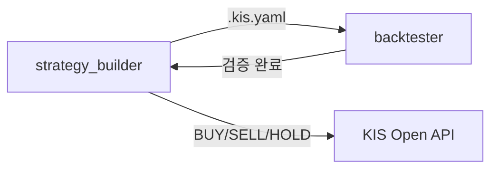

**[당사에서 제공하는 샘플코드에 대한 유의사항]**

- 샘플 코드는 한국투자증권 Open API(KIS Developers)를 연동하는 예시입니다. 고객님의 개발 부담을 줄이고자 참고용으로 제공되고 있습니다.
- 샘플 코드는 별도의 공지 없이 지속적으로 업데이트될 수 있습니다.
- 샘플 코드를 활용하여 제작한 고객님의 프로그램으로 인한 손해에 대해서는 당사에서 책임지지 않습니다.

# KIS Open API 샘플 코드 저장소 (LLM 지원)

## 1. 제작 의도 및 대상

### 🎯 제작 의도

이 저장소는 **ChatGPT, Claude 등 LLM(Large Language Model)** 기반 자동화 환경과 Python 개발자 모두가
**한국투자증권(Korea Investment & Securities) Open API를 쉽게 이해하고 활용**할 수 있도록 구성된 샘플 코드 모음입니다.

- `examples_llm/`: LLM이 단일 API 기능을 쉽게 탐색하고 호출할 수 있도록 구성된 기능 단위 샘플 코드
- `examples_user/`: 사용자가 실제 투자 및 자동매매 구현에 활용할 수 있도록 상품별로 통합된 API 호출 예제 코드
- `strategy_builder/`: 비주얼 UI로 매매 전략을 설계하고, 생성된 시그널 바탕으로 매수/매도 가능
- `backtester/`: 설계한 전략을 과거 데이터로 검증하는 백테스팅 엔진

> AI와 사람이 모두 활용하기 쉬운 구조를 지향합니다.

[한국투자증권 Open API 포털 바로가기](https://apiportal.koreainvestment.com/)

### 👤 대상 사용자

- 한국투자증권 Open API를 처음 사용하는 Python 개발자
- 기존 Open API 사용자 중 코드 개선 및 구조 학습이 필요한 사용자
- LLM 기반 코드 에이전트를 활용해 종목 검색, 시세 분석, 자동매매 등을 구현하고자 하는 사용자

## 2. 폴더 구조 및 주요 파일 설명

### 2.1. 폴더 구조

```
# 프로젝트 구조
.
├── README.md                    # 프로젝트 설명서
├── strategy_builder/            # 전략 설계 + 시그널 생성 엔진           ← New
├── backtester/                  # 백테스팅 엔진 (QuantConnect Lean)   ← New
│
├── docs/
│   └── convention.md            # 코딩 컨벤션 가이드
├── examples_llm/                  # LLM용 샘플 코드
│   ├── kis_auth.py              # 인증 공통 함수
│   ├── auth                     # 인증(토큰 발급)
│   │   ├── auth_token               # REST 접근토큰 발급
│   │   └── auth_ws_token            # 웹소켓 접속키 발급
│   ├── domestic_bond            # 국내채권
│   │   └── inquire_price        # API 단일 기능별 폴더
│   │       ├── inquire_price.py         # 한줄 호출 파일 (예: 채권 가격 조회)
│   │       └── chk_inquire_price.py     # 테스트 파일 (예: 채권 가격 조회 결과 검증)
│   ├── domestic_futureoption    # 국내선물옵션
│   ├── domestic_stock           # 국내주식
│   ├── elw                      # ELW
│   ├── etfetn                   # ETF/ETN
│   ├── overseas_futureoption    # 해외선물옵션
│   └── overseas_stock           # 해외주식
├── examples_user/                 # user용 실제 사용 예제
│   ├── kis_auth.py              # 인증 공통 함수
│   ├── auth                     # 인증(토큰 발급)
│   │   ├── auth_functions.py            # 인증 함수 모음
│   │   └── auth_examples.py             # 인증 실행 예제
│   ├── domestic_bond            # 국내채권
│   │   ├── domestic_bond_functions.py        # (REST) 통합 함수 파일 (모든 API 함수 모음)
│   │   ├── domestic_bond_examples.py         # (REST) 실행 예제 파일 (함수 사용법)
│   │   ├── domestic_bond_functions_ws.py     # (Websocket) 통합 함수 파일
│   │   └── domestic_bond_examples_ws.py      # (Websocket) 실행 예제 파일
│   ├── domestic_futureoption    # 국내선물옵션
│   ├── domestic_stock           # 국내주식
│   ├── elw                      # ELW
│   ├── etfetn                   # ETF/ETN
│   ├── overseas_futureoption    # 해외선물옵션
│   └── overseas_stock           # 해외주식
├── legacy/                      # 구 샘플코드 보관
├── stocks_info/                 # 종목정보파일 참고 데이터
├── kis_devlp.yaml               # API 설정 파일 (개인정보 입력 필요)
├── pyproject.toml               # (uv)프로젝트 의존성 관리
└── uv.lock                      # (uv)의존성 락 파일
```

### 2.2. 지원되는 주요 API 카테고리

- 아래 카테고리 및 폴더 구조는 examples_llm/, examples_user/ 폴더 모두 동일하게 적용됩니다.

| 카테고리 | 설명 | 폴더명 |
| --- | --- | --- |
| 인증 | 접근토큰 발급, 웹소켓 접속키 발급 | `auth` |
| 국내주식 | 국내 주식 시세, 주문, 잔고 등 | `domestic_stock` |
| 국내채권 | 국내 채권 시세, 주문 등 | `domestic_bond` |
| 국내선물옵션 | 국내 파생상품 관련 | `domestic_futureoption` |
| 해외주식 | 해외 주식 시세, 주문 등 | `overseas_stock` |
| 해외선물옵션 | 해외 파생상품 관련 | `overseas_futureoption` |
| ELW | ELW 시세 API | `elw` |
| ETF/ETN | ETF, ETN 시세 API | `etfetn` |

### 2.3. 주요 파일 설명

### `examples_llm/` - llm용 기능 단위 샘플 코드

**API별 개별 폴더 구조**: 단일 API 기능을 독립 폴더로 분리하여, LLM이 관련 코드를 쉽게 탐색할 수 있도록 구성
- **한줄 호출 파일**: `[함수명].py` – 단일 기능을 호출하는 최소 단위 코드 (예: `inquire_price.py`)
- **테스트 파일**: `chk_[함수명].py` – 호출 결과를 검증하는 테스트 실행 코드 (예: `chk_inquire_price.py`)

### `examples_user/` - 사용자용 통합 예제 코드

**카테고리별 개별 폴더 구조**: 카테고리(상품)별로 모든 기능을 통합하여, 사용자가 쉽게 샘플 코드를 탐색하고 실행할 수 있도록 구성
- **통합 함수 파일**: `[카테고리]_functions.py` - 해당 카테고리의 모든 API 기능이 통합된 함수 모음
- **실행 예제 파일**: `[카테고리]_examples.py` - 실제 사용 예제를 기반으로 한 실행 코드
- **웹소켓 통합 함수 파일 및 실행 예제 파일**: `[카테고리]_functions_ws.py`, `[카테고리]_examples_ws.py`

### `kis_auth.py` - 인증 및 공통 기능

- 접근토큰 발급 및 관리
- API 호출 공통 함수
- 실전투자/모의투자 환경 전환 지원
- 웹소켓 연결 설정 기능 제공

### 2.4. AI 트레이딩 도구

샘플 코드 외에, Open API를 활용한 **전략 설계 → 백테스팅 → 주문 실행** 파이프라인을 제공합니다.



| 디렉토리 | 역할 | 상세 |
|----------|------|------|
| `strategy_builder/` | 전략 설계 + 시그널 생성 | 80개 기술지표, 10개 프리셋 전략, BUY/SELL/HOLD 신호 ([README](strategy_builder/README.md)) |
| `backtester/` | 과거 검증 + 파라미터 최적화 | Docker 기반 QuantConnect Lean, HTML 리포트 ([README](backtester/README.md)) |
| `MCP/` | AI 도구 연결 | KIS Code Assistant + Trading MCP ([README](MCP/README.MD)) |

#### KIS Quant Desk 운영 포트

KIS Quant Desk는 모의투자와 실전투자를 동시에 검증할 수 있도록 Strategy Builder 백엔드를 분리 운영합니다. 두 백엔드는 컨테이너 내부에서는 각각 `8000`을 사용하지만, 운영 판단은 Caddy가 노출하는 외부 포트 기준으로 합니다.

| 포트 | 용도 | 백엔드 서비스 | 런타임/토큰 | 운영 목적 |
|------|------|---------------|-------------|-----------|
| `8081` | 모의투자 `vps` | `builder-backend-vps` | `token-vps`, `runtime-vps` | 매일 자동화를 돌려 수익률과 안정성을 검증 |
| `8082` | 백테스터 | `backtest-backend` | Lean workspace | 전략 백테스트와 리포트 생성 |
| `8083` | 실전투자 `prod` | `builder-backend-prod` | `token-prod`, `runtime-prod` | 승인 기반 실전 자동화 테스트 |

`KIS_LOCK_MODE`가 적용되어 `8081`은 `prod` 로그인을 거부하고, `8083`은 `vps` 로그인을 거부해야 합니다. `127.0.0.1:8000`은 컨테이너 내부 또는 로컬 개발용 백엔드 포트일 수 있으므로 운영 상태 판단에 사용하지 않습니다.

#### KIS Quant Desk — `/execute` 주문 실행 화면

`strategy_builder`의 실행 화면은 `http://<host>:8081/execute` 또는 `http://<host>:8083/execute`에서 전략 신호 확인, 계좌 상태 확인, 주문 실행을 한 화면에서 처리하도록 확장되어 있습니다. 모의 자동화와 검증은 `8081`, 승인 기반 실전 테스트는 `8083`을 사용합니다.

| 항목 | 상세 |
|------|------|
| 시장 전환 | 상단 세그먼트에서 `한국` / `미국` 시장을 전환합니다. 선택된 시장에 따라 종목 입력, 시세 조회, 계좌/잔고 조회, 미체결 조회, 주문 API가 분리됩니다. |
| 한국 종목 입력 | 종목명 또는 6자리 종목코드 검색을 지원합니다. 마스터파일 기반 자동완성, 빠른 선택, 붙여넣기 일괄 입력, 로컬 저장소 복원을 제공합니다. |
| 미국 심볼 입력 | `NVDA`, `AAPL`, `TSLA`, `MSFT`, `QQQ`, `SPY` 같은 미국 심볼을 직접 입력하거나 빠른 선택할 수 있습니다. 입력 시 KIS 해외주식 검색 API로 거래소(`NASD`, `NYSE`, `AMEX`)와 종목명을 확인합니다. |
| 전략 실행 | 선택한 전략과 종목 목록을 `/api/strategies/execute`로 전달합니다. 미국 시장에서는 요청에 `market: "us"`와 심볼별 거래소 메타데이터를 함께 넘겨 일봉/현재가 조회가 해외주식 API로 라우팅됩니다. |
| 신호표 | BUY / SELL / HOLD 신호를 종목별로 표시합니다. 미국 신호에는 거래소와 자동 추정 경고가 함께 표시될 수 있습니다. |
| 현재가/매수가능 조회 | 주문 확인 전 한국 종목은 국내 현재가/매수가능 API를, 미국 심볼은 해외 현재가/매수가능 API를 호출합니다. 미국 금액은 USD 기준으로 표시합니다. |
| 계좌 패널 | 시장 전환에 맞춰 보유종목, 예수금, 평가금액, 손익, 미체결 주문을 다시 조회합니다. 한국 주문 후에는 국내 계좌 캐시를 비우고, 미국 주문 후에는 해외 잔고 캐시를 갱신합니다. |
| 주문 확인 모달 | 주문 종목, 방향, 수량, 가격, 주문유형, 시장, 거래소를 최종 확인합니다. 미국 주식 주문은 지정가만 허용합니다. |
| 실전 주문 확인 | 해외주식 실전(`prod`/`real`) 주문은 `confirm_prod=true` 확인값이 없으면 서버에서 차단합니다. Codex/에이전트 사용 시에도 실전 주문 전 수동 확인이 필요합니다. |
| 미체결 취소 | 한국 미체결은 국내 취소 API, 미국 미체결은 해외 취소 API를 사용합니다. 취소 후 계좌/미체결 목록을 다시 조회합니다. |

#### 해외주식 API 확장

`strategy_builder/backend/routers/overseas.py`는 `/api/overseas` prefix로 미국 주식 실행에 필요한 API를 제공합니다.

| 엔드포인트 | 역할 |
|------------|------|
| `GET /api/overseas/search/{symbol}` | 심볼의 거래소와 종목명을 확인합니다. 거래소 미지정 시 NASDAQ, NYSE, AMEX 순서로 탐색하고 실패 시 NASDAQ 기준으로 fallback합니다. |
| `GET /api/overseas/price/{symbol}` | 해외 현재가, 등락, 거래량, 52주 고저가를 조회합니다. |
| `GET /api/overseas/holdings` | 해외 보유종목, 수량, 평균가, 현재가, 평가금액, 손익을 조회합니다. |
| `GET /api/overseas/balance` | USD 기준 예수금, 평가금액, 매입금액, 손익을 조회합니다. |
| `GET /api/overseas/buyable/{symbol}` | 지정가 기준 매수가능금액과 가능수량을 조회합니다. |
| `GET /api/overseas/pending` | 해외 미체결 주문을 조회합니다. |
| `POST /api/overseas/order` | 해외 지정가 주문을 실행합니다. 내부적으로 공통 주문 검증과 감사 로그를 공유합니다. |
| `POST /api/overseas/cancel` | 해외 미체결 주문 취소를 요청합니다. |

#### 보호주문 / 리스크 관리

전략 빌더의 리스크 설정을 주문 실행까지 연결해 앱 레벨 보호주문을 생성합니다.

| 항목 | 상세 |
|------|------|
| 생성 조건 | BUY 주문이 성공하고 전략의 `takeProfit` 또는 `stopLoss`가 활성화되어 있으면 보호주문 그룹을 생성합니다. |
| 익절 | 익절 비율이 있으면 목표가를 계산하고 지정가 매도 주문을 시도합니다. 한국 주식은 호가 단위에 맞춰 올림, 미국 주식은 소수점 2자리로 반올림합니다. |
| 손절 | 백그라운드 모니터가 현재가를 주기적으로 확인합니다. 손절가 이하로 내려가면 기존 익절 주문을 취소한 뒤 청산 주문을 제출합니다. 한국은 시장가 매도, 미국은 현재가 기준 지정가 매도로 처리합니다. |
| 상태 저장 | 보호주문 상태는 `strategy_builder/.runtime/protective_orders.json`에 저장됩니다. 런타임 상태 파일은 `.gitignore`에 포함되어 커밋되지 않습니다. |
| 조회/수동 점검 | `GET /api/orders/protective`로 보호주문 목록을 조회하고, `POST /api/orders/protective/check`로 감시 루프를 즉시 1회 실행할 수 있습니다. |
| 한계 | KIS Open API 자체 OCO 주문이 아니라 애플리케이션 감시 기반입니다. 서버가 중단되면 손절/익절 자동 감시도 중단되므로 운영 환경에서는 프로세스 재시작 정책과 로그 감시가 필요합니다. |

#### 전략 검토 — 보유종목 손익절 감시

`http://<host>:8081/review` 또는 `http://<host>:8083/review`의 **전략 검토** 화면은 이미 보유 중인 한국/미국 주식에 손절·익절 감시 조건을 붙이는 운영 화면입니다. 전략 빌더에서 새 주문을 만들 때 붙는 보호주문과 달리, 이 화면은 “현재 계좌에 이미 있는 포지션”을 대상으로 합니다.

| 항목 | 상세 |
|------|------|
| 시장 탭 | `한국` / `미국` 탭을 제공합니다. 한국 탭은 `/api/account/holdings`, 미국 탭은 `/api/overseas/holdings`를 사용합니다. |
| 감시 사용 | 종목별 감시 규칙을 활성화합니다. 저장하면 `strategy_builder/.runtime/protective_orders.json`에 상태가 기록되고 백엔드 보호주문 서비스가 해당 종목을 감시합니다. |
| 손절/수익보존 매도 | 카드 좌측 블록입니다. 현재가가 도달가 이하가 되면 설정한 주문 방식으로 매도합니다. 기본값은 시장가입니다. |
| 익절 매도 | 카드 우측 블록입니다. 현재가가 도달가 이상이 되면 설정한 주문 방식으로 매도합니다. 기본값은 지정가입니다. |
| 주문 방식 | `시장가` 또는 `지정가`를 선택합니다. 지정가 선택 시 별도 지정가를 입력합니다. |
| 감시 수량 | 실제 보유 수량 이하로 입력해야 합니다. 저장 시 서버에서 수량과 기준 단가를 검증합니다. |
| 감시 주기 | REST fallback 주기를 초 단위로 설정합니다. 기본값은 15초이며 저장 가능 범위는 5~300초입니다. |
| 실시간 시세 | KIS WebSocket 실시간 체결가를 구독합니다. 국내는 `H0STCNT0`, 해외는 `HDFSCNT0` 흐름을 사용합니다. |
| REST fallback | WebSocket 틱이 최근 30초 안에 들어오면 REST 현재가 조회를 건너뜁니다. 장외, 권한 문제, 연결 오류 등으로 틱이 없으면 설정한 감시 주기마다 REST 조회로 조건을 점검합니다. |

**`지금 점검` 버튼**

`지금 점검`은 자동 감시 주기나 WebSocket 틱을 기다리지 않고, 서버의 보호주문 감시 루프를 **즉시 1회 실행**하는 버튼입니다.

- 저장된 모든 활성 보호주문을 대상으로 합니다.
- 현재 보유수량을 확인합니다.
- 조건 도달 여부를 평가합니다.
- 조건이 충족되면 설정된 매도 주문을 제출합니다.
- 점검 결과와 마지막 점검 시각은 보호주문 상태에 반영됩니다.
- WebSocket이 정상 동작 중이어도 수동 확인이 필요할 때 사용할 수 있습니다.

**주의사항**

- 이 기능은 KIS Open API의 서버 측 OCO 주문이 아니라 앱 레벨 감시입니다.
- 브라우저를 닫아도 백엔드 컨테이너가 살아 있으면 감시는 계속됩니다.
- 백엔드 컨테이너가 중지되면 자동 감시도 중지됩니다.
- 실전 주문 전에는 반드시 모의투자로 동작을 검증하세요.
- 해외주식 `HDFSCNT0`는 공식 샘플상 “실시간지연체결가” API이며, 미국은 무료 0분 지연으로 설명되어 있지만 시세 권한과 장 구분에 따라 체감 지연이 달라질 수 있습니다.

#### 한국장 자동매매 운영

`.codex/scripts/kr_market_auto_run.py`는 한국장 뉴스/매크로 요약, 유동성 기반 동적 후보군 시그널, BUY/SELL/HOLD 분리, 주문 후보 산출, 보유/미체결/예약/보호주문 재조회를 한 번에 수행하는 자동 실행 스크립트입니다.

**공통 동작**

| 항목 | 내용 |
|------|------|
| 후보군 | 기본 `KR_MARKET_CANDIDATE_MODE=dynamic`. 거래량, 체결강도, 시가총액, 외국인/기관 수급 기반으로 보수 유동성 후보를 선별하고, API 실패 또는 후보 부족 시 기존 대형주/ETF 고정 후보군으로 fallback |
| 신호 기준 | BUY 강도 `0.70` 이상만 신규 매수 후보 |
| 기본 보호라인 | 익절 `+6%`, 손절 `-3%` |
| 휴장일 처리 | `.codex/scripts/kr_market_calendar.py`로 KRX 거래일을 확인하고, 휴장/주말이면 주문 없이 `market_closed` 리포트만 생성 |
| LLM 판단 | `KR_MARKET_LLM_MODE=live-vps` 또는 `live-prod`일 때 CLIProxyAPI/OpenAI 호환 LLM이 BUY 후보를 승인, 축소, 차단 |
| 보호주문 한계 | KIS 서버 OCO가 아니라 앱 레벨 감시입니다. 백엔드, 인증, 네트워크가 중단되면 자동 감시도 중단될 수 있습니다. |

**국내 모의투자(vps) 일일 실행**

```bash
# 한국장 09:10 / 12:30 / 15:10 KST 크론 설치
.codex/scripts/install_kr_market_auto_daily_cron.sh

# 특정 슬롯 수동 실행
.codex/scripts/run_kr_market_auto_once.sh open 20260602
.codex/scripts/run_kr_market_auto_once.sh mid 20260602
.codex/scripts/run_kr_market_auto_once.sh close 20260602
```

모의투자 실행은 `8081`의 `builder-backend-vps`를 사용합니다. 래퍼는 `KIS_LOCK_MODE=vps`, `KIS_DEFAULT_MODE=vps`를 설정하고, 기본 API 엔드포인트를 `http://127.0.0.1:8081`로 고정해 실전 주문을 호출하지 않습니다. 실행 결과는 `.codex/runtime/kr_market_auto/`에 JSON/Markdown 리포트로 저장됩니다. 엔드포인트를 바꿔야 하면 `KIS_VPS_STRATEGY_API`를 사용합니다.

**미국 모의투자(vps) 일일 실행**

```bash
# 미국장 23:45 / 02:45 / 04:45 KST 크론 설치
.codex/scripts/install_us_market_auto_daily_cron.sh

# 특정 슬롯 수동 실행
.codex/scripts/run_us_market_auto_once.sh open 20260602
.codex/scripts/run_us_market_auto_once.sh mid 20260603 20260602
.codex/scripts/run_us_market_auto_once.sh close 20260603 20260602
```

미국장 모의 자동화도 `8081`의 `builder-backend-vps`만 사용합니다. 기본 `US_MARKET_CANDIDATE_MODE=dynamic`으로 거래대금, 시가총액, 매수체결강도, 거래량 급증 랭킹에서 NASDAQ/NYSE/AMEX 유동성 후보를 선별하며, `SPY`, `QQQ`, `DIA`, `IWM`은 core ETF로 유지합니다. 랭킹 API 실패 또는 후보 부족 시 기존 고정 후보군으로 fallback합니다. 실행 결과는 `.codex/runtime/us_market_auto/`에 저장되며, 장중 신규 매수와 보호주문 점검은 실전 `8083`과 분리됩니다.

**국내 실전투자(prod) 일일 실행**

실전 버전은 `8083`의 `builder-backend-prod`를 사용하며 기본적으로 리포트 전용입니다. 날짜와 슬롯별 1회성 승인 파일이 있을 때만 실제 주문이 제출됩니다.

```bash
# 실전 크론 설치. 기본은 주문 없이 리포트만 생성
.codex/scripts/install_kr_market_auto_prod_daily_cron.sh

# 특정 날짜/슬롯에 대해 실전 주문 1회 승인
.codex/scripts/approve_kr_market_auto_prod_once.sh 20260602 open

# 승인 파일 없이 수동 실행하면 리포트만 생성하고 주문은 제출하지 않음
.codex/scripts/run_kr_market_auto_prod_once.sh open 20260602
```

승인 파일은 `.codex/runtime/kr_market_auto_prod/approvals/YYYYMMDD_<slot>.approved` 형식이며, 실행 시작 시 소비되고 삭제됩니다. `.codex/local/kr_market_auto_prod.env`에 `KIS_PROD_AUTO_CONFIRM`이 남아 있어도 `run_kr_market_auto_prod_once.sh`가 이를 제거하므로 영구 자동승인으로 쓰이지 않습니다. 엔드포인트를 바꿔야 하면 `KIS_PROD_STRATEGY_API`를 사용합니다.

실전 주문은 `KR_MARKET_LLM_MODE=live-prod`일 때만 제출됩니다. `off` 또는 `shadow` 모드에서는 승인 파일이 있어도 리포트만 생성하고 주문은 차단합니다.

전략 신호 `SELL`은 보호주문 손익절 매도와 별도입니다. 보호주문 매도는 설정된 리스크 관리 규칙에 따라 자동 감시되지만, 전략 신호 `SELL`의 자동 실행은 기본적으로 꺼져 있습니다. 실험 중 전략 SELL까지 자동 실행하려면 명시적으로 플래그를 켭니다.

```bash
KR_PROD_ALLOW_STRATEGY_SELL=true \
  .codex/scripts/run_kr_market_auto_prod_once.sh open 20260602
```

실전 래퍼의 현재 실험용 기본 리스크는 `KR_MARKET_TOTAL_BUY_PCT=100`, `KR_MARKET_DAILY_LOSS_PCT=3`입니다. 이는 테스트 목적의 공격적인 설정이며, 일반 운영 전에는 낮은 값으로 조정해야 합니다.

```bash
# 예: 신규 매수 10%, 일 손실 0.5%로 낮춰 실행
KR_MARKET_TOTAL_BUY_PCT=10 KR_MARKET_DAILY_LOSS_PCT=0.5 \
  .codex/scripts/run_kr_market_auto_prod_once.sh open 20260602
```

**현재 운영 정책**

| 항목 | 정책 |
|------|----------|
| 실전 승인 | 날짜/슬롯별 1회성 승인 파일이 있을 때만 주문 제출. 승인 파일은 실행 시작 시 삭제됩니다. |
| prod LLM | `live-prod` 필수. `off`/`shadow`는 분석 리포트만 생성합니다. |
| 전략 SELL 자동 실행 | 기본 차단. `KR_PROD_ALLOW_STRATEGY_SELL=true`일 때만 자동 실행합니다. 보호주문 손익절 SELL은 별도 감시 규칙으로 동작합니다. |
| 실전 크론 슬롯 | 초기 실험은 `open` 1회가 가장 단순합니다. 하루 3회로 확장한다면 `open`은 신규 매수 가능, `mid`/`close`는 기본적으로 보유/미체결/보호주문 점검 위주로 운영하는 구성이 안전합니다. |
| BUY 배분 정책 | 현재 실험 설정은 강도 1순위 후보에 집중 배분하는 방식입니다. 분산 운용으로 전환하려면 강도 비례 배분 로직을 복구합니다. |

#### Docker 운영

KIS Quant Desk는 Docker Compose로 `builder-backend-vps`, `builder-backend-prod`, `builder-frontend`, `backtest-*`, `caddy`를 실행합니다. Caddy가 `8081`, `8082`, `8083`을 외부 운영 포트로 노출합니다.

```bash
# 저장소 루트에서 실행
docker compose --env-file .env.production -f compose.yml up -d --build \
  builder-backend-vps builder-backend-prod builder-frontend \
  backtest-backend backtest-frontend caddy

# 상태 확인
docker compose --env-file .env.production -f compose.yml ps

# 모의/실전 백엔드 로그 확인
docker logs -f kis-stack-builder-backend-vps-1
docker logs -f kis-stack-builder-backend-prod-1

# 프론트 로그 확인
docker logs -f kis-stack-builder-frontend-1
```

주요 화면은 다음과 같습니다.

| 경로 | 용도 |
|------|------|
| `http://<host>:8081/builder` | 모의투자 전략 빌더. 지표/조건/리스크를 조합하고 `.kis.yaml`로 내보냅니다. |
| `http://<host>:8081/execute` | 모의투자 전략 실행. 한국/미국 종목에 대해 시그널을 생성하고 주문을 실행합니다. |
| `http://<host>:8081/review` | 모의투자 보유 종목의 손절/익절 감시 조건과 실시간 시세 상태를 관리합니다. |
| `http://<host>:8083/builder` | 실전투자 전략 빌더. 실전 테스트 전용 포트입니다. |
| `http://<host>:8083/execute` | 실전투자 전략 실행. 실제 주문은 서버 확인값과 에이전트/사용자 승인이 있어야 제출됩니다. |
| `http://<host>:8083/review` | 실전투자 보유 종목 보호주문 감시 설정 화면입니다. |
| `http://<host>:8082` | 백테스터 UI입니다. |

운영 전 확인할 항목:

- `~ /KIS/config/kis_devlp.yaml` 또는 컨테이너에 마운트되는 KIS 설정 파일에 앱키, 앱시크릿, 계좌번호가 설정되어 있어야 합니다.
- `8081` UI 우측 상단 설정에서는 `vps`(모의), `8083` UI 우측 상단 설정에서는 `prod`(실전) 인증을 완료해야 합니다.
- Caddy Basic Auth를 사용하는 배포에서는 브라우저 접속 시 Basic Auth와 앱 내부 KIS 인증이 모두 필요합니다.
- `runtime-vps`와 `runtime-prod`의 보호주문 상태 파일은 서로 분리됩니다. 백업/초기화 정책을 운영 환경에 맞춰 정하세요.

#### 포함된 예시 전략

`strategies/custom/today_krx_vwap_rsi_rebound.kis.yaml`은 당일 한국장 대응형 반등 전략 예시입니다.

| 항목 | 값 |
|------|----|
| 진입 | 종가가 VWAP(14)을 상향 돌파하고 RSI(14)가 45 초과 |
| 청산 | 종가가 VWAP(14)을 하향 돌파하거나 RSI(14)가 65 초과 |
| 리스크 | 손절 2%, 익절 4%, 트레일링 스탑 1.5% |
| 용도 | 약세 출발 후 VWAP 회복과 RSI 중립권 복귀를 확인하는 단기 반등 시나리오 검증 |

#### 10개 프리셋 전략

`strategy_builder`와 `backtester` 양쪽에서 동일하게 지원합니다.

| # | 전략명 | 유형 | 한줄 설명 |
|---|--------|------|-----------|
| 01 | 골든크로스 | 추세추종 | 단기 이동평균이 장기 이동평균을 상향 돌파하면 매수 |
| 02 | 모멘텀 | 추세추종 | 최근 N일 수익률이 높은 종목을 매수 |
| 03 | 52주 신고가 | 돌파매매 | 종가가 52주 최고가를 갱신하면 매수 |
| 04 | 연속 상승/하락 | 추세추종 | N일 연속 종가 상승 시 매수, N일 연속 하락 시 매도 |
| 05 | 이격도 | 역추세 | 종가/이동평균 비율로 과열(매도)·침체(매수) 판단 |
| 06 | 돌파 실패 | 손절 | 전고점 돌파 후 다시 아래로 빠지면 손절 |
| 07 | 강한 종가 | 모멘텀 | 종가가 당일 고가 근처에서 마감하면 매수 |
| 08 | 변동성 확장 | 돌파매매 | 변동성이 줄어든 뒤 급등하면 매수 |
| 09 | 평균회귀 | 역추세 | 가격이 평균에서 크게 벗어나면 반대 방향으로 매매 |
| 10 | 추세 필터 | 추세추종 | 장기 이동평균 위에서 상승 중이면 매수 |

#### .kis.yaml — 공유 전략 포맷

`strategy_builder`에서 설계한 전략을 `.kis.yaml`로 내보내면, `backtester`에서 그대로 Import하여 백테스트를 수행할 수 있습니다.
포맷 상세는 [strategy_builder/README.md](strategy_builder/README.md#kisyaml-포맷) 또는 [backtester/README.md](backtester/README.md#kisyaml-포맷)를 참고하세요.

## 3. 사전 환경설정 안내

### 3.1. Python 환경 요구사항

- **Python 3.11 이상** 필요
- **uv** **패키지 매니저 사용** 권장 (빠르고 간편한 의존성 관리)

### 3.2. uv 설치 방법

- 간편 설정을 위해 uv를 권장합니다

```bash
# Windows (PowerShell)
powershell -c "irm https://astral.sh/uv/install.ps1 | iex"

# macOS/Linux
curl -LsSf https://astral.sh/uv/install.sh | sh

# 설치 확인
uv --version
# uv 0.x.x ... -> 설치 완료
```

### 3.3. 프로젝트 클론 및 환경 설정

```bash
# 저장소 클론
git clone https://github.com/koreainvestment/open-trading-api
cd open-trading-api

# uv를 사용한 의존성 설치 - 한줄로 끝
uv sync
```

### 3.4. KIS Open API 신청 및 설정

🍀 [서비스 신청 안내 바로가기](https://apiportal.koreainvestment.com/about-howto)
1. 한국투자증권 **계좌 개설 및 ID 연결**
2. 한국투자증권 홈페이지 or 앱에서 **Open API 서비스 신청**
3. **앱키(App Key)**, **앱시크릿(App Secret)** 발급
4. **모의투자** 및 **실전투자** 앱키 각각 준비

### 3.5. kis_devlp.yaml 설정

- 본인의 계정 설정을 위해 `kis_devlp.yaml` 파일을 수정합니다.
- 기본 경로는 `~/KIS/config/kis_devlp.yaml`입니다. 폴더가 없으면 생성해 주세요.
- 프로젝트 루트의 `kis_devlp.yaml`을 `~/KIS/config/`로 복사한 뒤 수정하는 것을 권장합니다.
- 경로를 변경하고 싶다면 `kis_auth.py`의 `config_root` 값을 수정하면 됩니다.

```bash
# 설정 폴더 생성 및 파일 복사
mkdir -p ~/KIS/config
cp kis_devlp.yaml ~/KIS/config/
```

1. `~/KIS/config/kis_devlp.yaml` 파일 열기
2. **앱키와 앱시크릿** 정보 입력
3. **HTS ID** 정보 입력
4. **계좌번호** 정보 입력 (앞 8자리와 뒤 2자리 구분)
5. **저장** 후 닫기

```yaml
# 실전투자
my_app: "여기에 실전투자 앱키 입력"
my_sec: "여기에 실전투자 앱시크릿 입력"

# 모의투자
paper_app: "여기에 모의투자 앱키 입력"
paper_sec: "여기에 모의투자 앱시크릿 입력"

# HTS ID(KIS Developers 고객 ID) - 체결통보, 나의 조건 목록 확인 등에 사용됩니다.
my_htsid: "사용자 HTS ID"

# 계좌번호 앞 8자리
my_acct_stock: "증권계좌 8자리"
my_acct_future: "선물옵션계좌 8자리"
my_paper_stock: "모의투자 증권계좌 8자리"
my_paper_future: "모의투자 선물옵션계좌 8자리"

# 계좌번호 뒤 2자리
my_prod: "01" # 종합계좌
# my_prod: "03" # 국내선물옵션 계좌
# my_prod: "08" # 해외선물옵션 계좌
# my_prod: "22" # 개인연금 계좌
# my_prod: "29" # 퇴직연금 계좌

# User-Agent(기본값 사용 권장, 변경 불필요)
my_agent: "Mozilla/5.0 (Windows NT 10.0; Win64; x64) AppleWebKit/537.36"
```

### 3.6. 실행파일 내 인증 설정 검토

- 실행하려는 파일에서 인증 관련 설정을 검토 혹은 변경해줍니다. 국내주식 기능 전체를 이용하시려면, `domestic_stock/domestic_stock_examples.py` 파일을 확인해주세요. 
ka.auth() 함수의 svr, product 매개변수를 아래와 같이 수정하면 실전환경(prod)에서 위탁계좌(-01)로 매매 테스트가 가능합니다.

```python
import kis_auth as ka

# 실전투자 인증
ka.auth(svr="prod", product="01") # 모의투자: svr="vps"
```

### 3.7. 전략 빌더 / 백테스터 환경 설정 (선택)

전략 설계 및 백테스팅 기능을 사용하려면 추가 설정이 필요합니다.

| 항목 | 설치 | 용도 |
|------|------|------|
| Node.js 18+ | [nodejs.org](https://nodejs.org/) | strategy_builder, backtester 프론트엔드 |
| Docker Desktop | [docker.com](https://www.docker.com/products/docker-desktop) | backtester (Lean 엔진) |

## 4. 샘플 코드 실행

### 4.1. 샘플 코드 실행

- **examples_user 기준**

```bash
# 국내주식 샘플 코드 실행 (examples_user/domestic_stock/)
uv run python domestic_stock_examples.py # REST 방식
uv run python domestic_stock_examples_ws.py  # Websocket 방식 
```

domestic_stock_examples.py에는 여러 함수가 포함되어 있으므로, 사용하려는 함수만 남기고 나머지는 주석 처리한 후, 입력값을 수정하여 호출해 주세요.

- **examples_llm 기준**

```bash
# 국내주식 > 주식현재가 시세 샘플 코드 실행 (examples_llm/domestic_stock/inquire_price/)
uv run python chk_inquire_price.py
```

examples_llm 은 각 기능별로 개별 실행 파일(chk_*.py)이 분리되어 있어, 특정 기능만 테스트하고자 할 때 유용합니다.

### 4.2. 예제 코드 샘플 (examples_user)

```python
# REST API 호출 예제 - domestic_stock_examples.py
import sys
import logging
import pandas as pd
sys.path.extend(['..', '.'])

import kis_auth as ka
from domestic_stock_functions import *

# 로깅 설정
logging.basicConfig(level=logging.INFO, format='%(levelname)s - %(message)s')
logger = logging.getLogger(__name__)

# 인증
ka.auth()
trenv = ka.getTREnv()

# 삼성전자 현재가 시세 조회
result = inquire_price(env_dv="real", fid_cond_mrkt_div_code="J", fid_input_iscd="005930")
print(result)
```

```python
# 웹소켓 호출 예제 - domestic_stock_examples_ws.py
import sys
import logging
import pandas as pd
sys.path.extend(['..', '.'])

import kis_auth as ka
from domestic_stock_functions_ws import *

# 로깅 설정
logging.basicConfig(level=logging.INFO, format='%(levelname)s - %(message)s')
logger = logging.getLogger(__name__)

# 인증
ka.auth()
ka.auth_ws()
trenv = ka.getTREnv()

# 웹소켓 선언
kws = ka.KISWebSocket(api_url="/tryitout")

# 삼성전자, sk하이닉스 실시간 호가 구독
kws.subscribe(request=asking_price_krx, data=["005930", "000660"])
```

### 4.3. 전략 빌더 / 백테스터 실행

```bash
# Strategy Builder (전략 설계 + 시그널)
cd strategy_builder
./start.sh

# Backtester (백테스팅)
cd backtester
./start.sh
```

상세 실행 방법은 각 디렉토리의 README를 참고하세요:
- [strategy_builder/README.md](strategy_builder/README.md)
- [backtester/README.md](backtester/README.md)

## 5. 문제 해결 가이드

### 토큰 오류 시

```python
import kis_auth as ka

# 토큰 재발급 - 1분당 1회 발급됩니다.
ka.auth(svr="prod")  # 또는 "vps"
```

### 설정 파일 오류 시

- `kis_devlp.yaml` 파일의 앱키, 앱시크릿이 올바른지 확인
- 계좌번호 형식이 맞는지 확인 (앞 8자리 + 뒤 2자리)
- 실시간 시세(WebSocket) 이용 중 ‘No close frame received’ 오류가 발생하는 경우, `kis_devlp.yaml`에 입력하신 HTS ID가 정확한지 확인

### 의존성 오류 시

```bash
# 의존성 재설치
uv sync --reinstall
```

### Docker 오류 (backtester)

```bash
docker info              # Docker Desktop 실행 상태 확인
docker images | grep lean # Lean 이미지 확인 (첫 실행 시 자동 다운로드)
```

### 초당 거래건수 초과 (`EGW00201`)

모의투자 계좌는 REST API 호출 제한이 낮습니다.
단일 조회에는 문제없으나, 파라미터 최적화처럼 연속 호출이 많으면 실전투자 계좌를 권장합니다.

---

# 📧 문의사항

- [💬 한국투자증권 Open API 챗봇](https://chatgpt.com/g/g-68b920ee7afc8191858d3dc05d429571-hangugtujajeunggweon-open-api-seobiseu-gpts)에 언제든 궁금한 점을 물어보세요.
